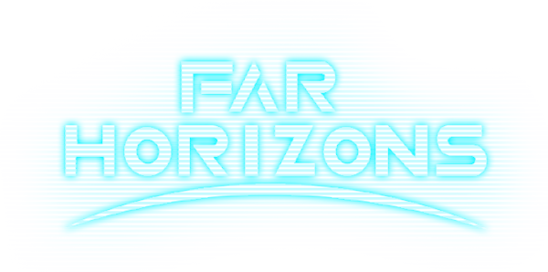

  

# Far Horizons
Space-Station 14

FAR HORIZONS is a server meticulously crafted for immersive storytelling! Our core mission is to weave a compelling narrative tapestry between players and the expansive universe., 

## Space-Station 14 Documentation/Wiki

Space-Station 14 has [docs site](https://docs.spacestation14.io/) documentation on SS14s content, engine, game design and more. We also have lots of resources for new contributors to the project.

## Project Activity

---

## License

> [!CAUTION]
> Unless stated otherwise in the file, the repository code is licensed under one of two licenses: [MIT](https://github.com/Far-Horizons-SS14/Far-Horizons-SS14/blob/Far-Horizons/LICENSE.TXT) - this applies to original code by Space Wizards Federation and later Far Horizons changes; And [modified MIT](https://github.com/Far-Horizons-SS14/Far-Horizons-SS14/blob/Far-Horizons/LICENSE-Starlight.TXT) - this applies to changes originally forked and later ported from StarLight. As well as all submissions to this repository prior to commit 5b5744cd91479b9a283be62626ec9d13fcb27f9a.

> [!CAUTION]
> Prior to commit 5b5744cd91479b9a283be62626ec9d13fcb27f9a, every code submission in this repository was licensed under [modified MIT](https://github.com/Far-Horizons-SS14/Far-Horizons-SS14/blob/Far-Horizons/LICENSE-Starlight.TXT). These additions were not retroactively relicensed.

Please note that assets are licensed separately from code and specify their license in their respective metadata or attributions file.

List of non-MIT code additions:
- Nuclear reactor-related code was taken from goonstation, and therefore licensed under CC-BY-NC-SA-3.0

### Click each banner for further information

---

>Some files are licensed under [MIT license](https://opensource.org/license/MIT), these files are Space Wizards Federation code.

>All other non-code STARLIGHT Assets, including icons and sound files, are licensed under the [Creative Commons 3.0 BY-SA](https://creativecommons.org/licenses/by-sa/3.0/) license unless otherwise noted in the folder or file.

